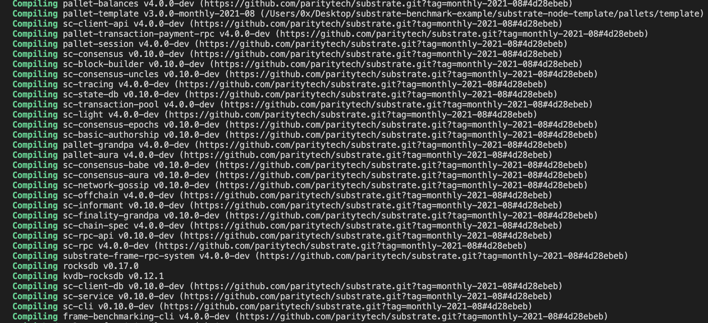
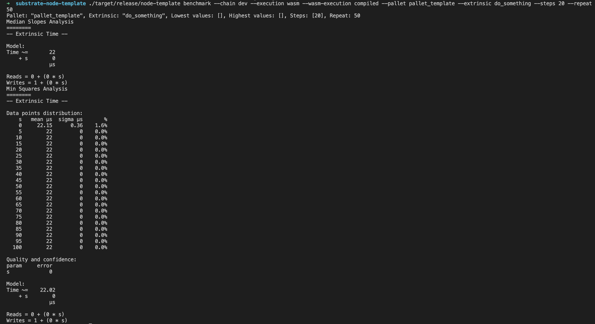
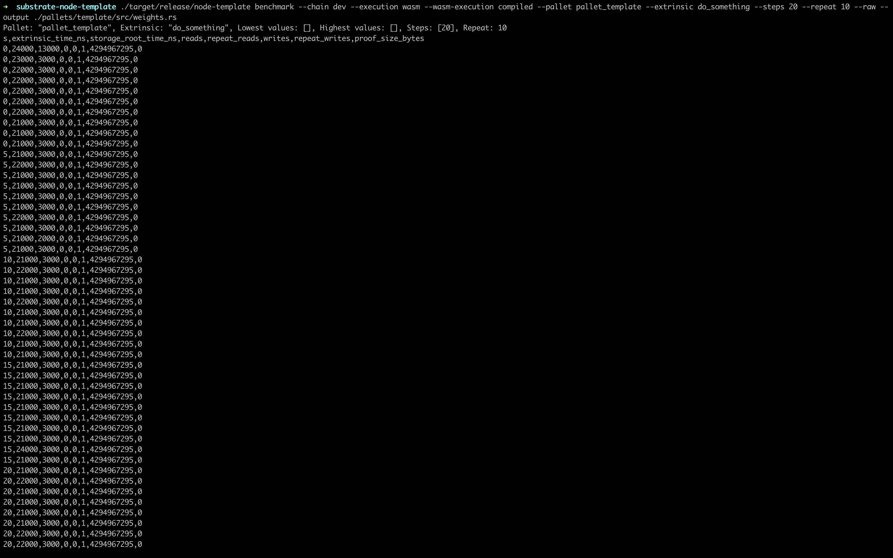
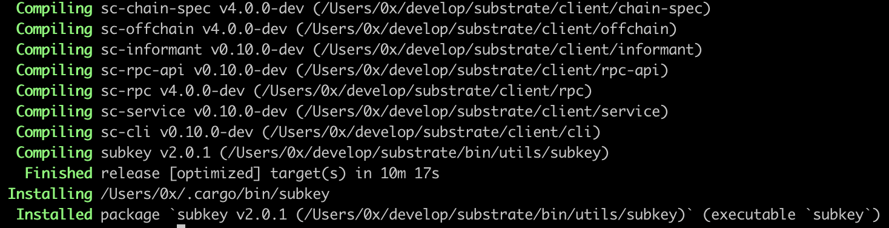
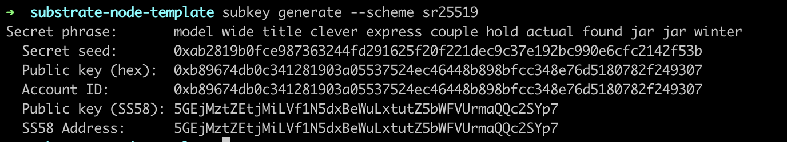
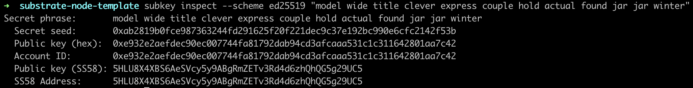
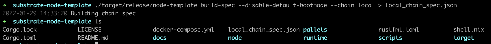
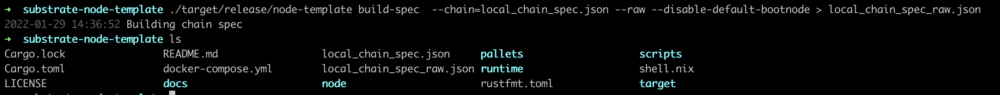
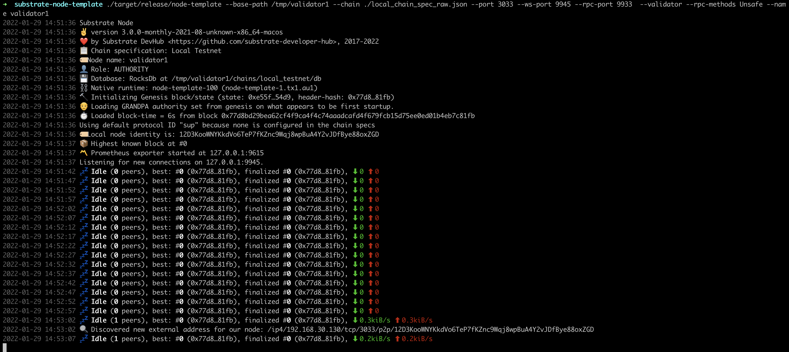
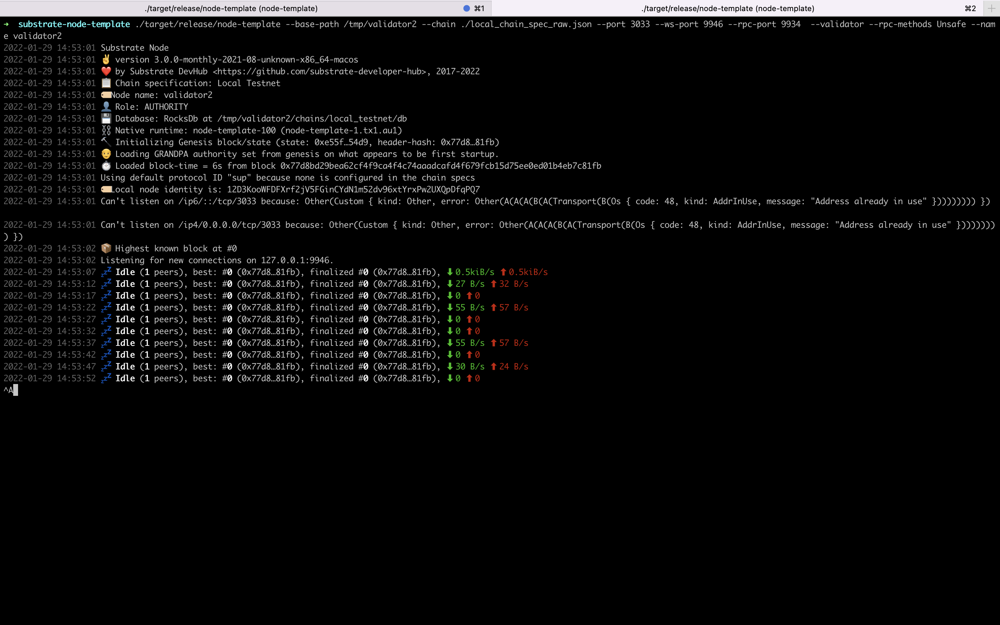

# substrate-benchmark-example
基于substrate4.0版本的benchmark测试示例
1) 编译基准测试:
```shell
cargo build --features runtime-benchmarks --release
```  
  

2) 运行基准测试:
```
./target/release/node-template benchmark --chain dev --execution wasm --wasm-execution compiled --pallet pallet_template --extrinsic do_something --steps 20 --repeat 50 
```  
  

3) 生成权重定义:
```
./target/release/node-template benchmark --chain dev --execution wasm --wasm-execution compiled --pallet pallet_template --extrinsic do_something --steps 20 --repeat 50 --raw --output ./pallets/template/src/weights.rs
```  
  

4)下载substrate源码并安装subkey:
```
git clone git://github.com/paritytech/substrate.git
cd substrate/bin/utils
cargo install --force --path subkey subkey
```  
  

5)添加初始区块账户:
```
subkey generate --scheme sr25519
```  
  

6)根据助记词生成session keys:
```
subkey inspect --scheme ed25519 "model wide title clever express couple hold actual found jar jar winter"
```  
  

7)生成chain spec:
```
./target/release/node-template build-spec --disable-default-bootnode --chain local > local_chain_spec.json
```  
  

8)编码chain spec:
```
./target/release/node-template build-spec  --chain=local_chain_spec.json --raw --disable-default-bootnode > local_chain_spec_raw.json
```  
  

9)使用chain spec文件,部署公开网络节点1:
```
./target/release/node-template --base-path /tmp/validator1 --chain ./local_chain_spec_raw.json --port 3033 --ws-port 9945 --rpc-port 9933  --validator --rpc-methods Unsafe --name validator1
```  

  

10)使用chain spec文件,部署公开网络节点2:
```
./target/release/node-template --base-path /tmp/validator2 --chain ./local_chain_spec_raw.json --port 3033 --ws-port 9946 --rpc-port 9934  --validator --rpc-methods Unsafe --name validator2
```  

  

